## Matriks
Matriks adalah sususan bilangan dalam bentuk baris dan kolom sehingga membentuk suatu bangun persegi.

### Matriks dan Jenisnya
Matriks A berikutt berukuran (Ordo) *m x n* :
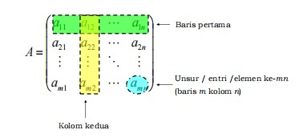

> **Note**: Misalkan A dan B adalah matriks berukuran sama. 
> A dan B dikatakan sama (notasi A = B) jika :
> *Aij = Bij, untuk setiap i dan j*

### Jenis - jenis Matriks

#### 1. Matriks Bujur Sangkar (Persegi)
Matriks yang **jumlah baris dan jumlah kolomnya adalah sama** (*n x n*).

Contoh:
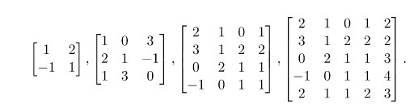

#### 2. Matriks Diagonal
Suatu matriks persegi dimana setiap unsur yang bukan merupakan unsur diagonal adalah nol.

Contoh:
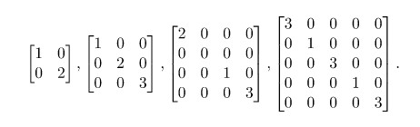

> 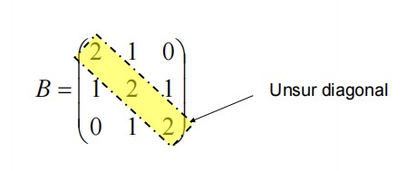

#### 3. Matriks Segitiga Atas
Suatu matriks yang **semua unsur dibawah** *unsur diagonal* pada kolom yang bersesuaian bernilai **nol**.

Contoh:
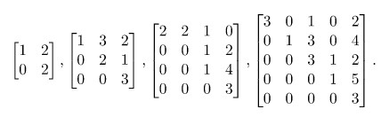

#### 4. Matriks Segitiga Bawah
Suatu matriks yang **semua unsur diatas** *unsur diagonal* pada kolom yang bersesuaian bernilai **nol**.

Contoh
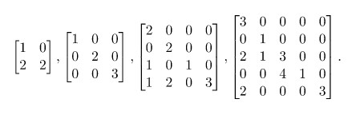

#### 5. Matriks Satuan (Identitas)
Suatu matriks dimana **setiap unsur diagonalnya adalah satu**.

Contoh:
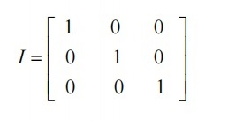

#### 6. Matriks Simetri
Suatu matriks persegi disebut matriks simetri **jika *transpose* dari matriks tersebut adalah *dirinya sendiri***. 

Contoh:
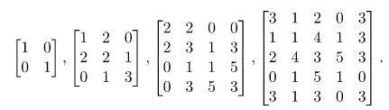

> Matriks transpos diperoleh dengan **menukar baris matriks menjadi 
> kolom seletak, atau sebaliknya**. Notasi Aᵗ (hasil transpos matriks A).
> 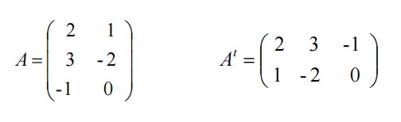

#### 7. Matriks Bentuk Eselon Baris
Suatu matriks disebut matriks bentuk eselon baris jika memenuhi kriteria-kriteria berikut:
1. Entri tak nol pertama pada setiap baris adalah 1, yang selanjutnya disebut leading one.
2. Setiap baris yang memuat leading one, entri 1 terletak disebelah kanan leading one baris sebelumnya.
3. Baris yang semua entrinya nol (jika ada), terletak di bawah baris yang memuat leading one.

Contoh:
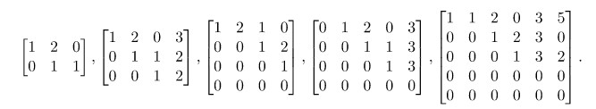

#### 8. Matriks Bentuk Eselon Baris Tereduksi
Suatu matriks disebut matriks bentuk eselon baris jika memenuhi kriteria-kriteria berikut:
1. Entri tak nol pertama pada setiap baris adalah 1, yang selanjutnya disebut leading one.
2. Setiap baris yang memuat leading one, entri 1 terletak disebelah kanan leading one baris sebelumnya.
3. Baris yang semua entrinya nol (jika ada), terletak di bawah baris yang memuat leading one.
4. Setiap kolom yang memuat leading one, entri-entri selain leading one adalah nol.

Contoh:
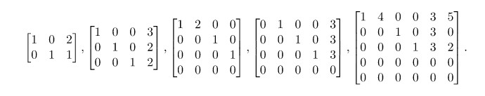

---
Referensi: https://aljabarlinear.mipa.ugm.ac.id/matriks/matriks-matriks-khusus/