## Sampel dan Populasi

#### Populasi
Populasi adalah jumlah keseluruhan dari satuan-satuan atau individu-individu yang karakteristiknya hendak diteliti. Dan satuan-satuan tersebut dinamakan **unit analisis**, dan *dapat berupa orang-orang, institusi-institusi, benda-benda*, dst. (Djarwanto, 1994: 420).

#### Sampel
Berdasarkan pakar atau ahli, "sampel adalah sebagian dari populasi yang karakteristiknya hendak diteliti" (Djarwanto, 1994:43). Sampel yang baik, yang kesimpulannya dapat dikenakan pada populasi, adalah sampel yang bersifat representatif atau yang dapat menggambarkan karakteristik populasi. Sampel bisa disebut juga sebagai **contoh**. 

#### Ringkasan Sampel dan Populasi

Berdasarkan gambar ilustrasi populasi dan sampel diatas, maka dapat kita simpulkan bahwa **populasi itu seperti sebuah organisme**, sedangkan **sampel adalah organ**. *Jadi, sampel adalah bagian yang tidak terpisahkan dari populasi*. Dan sampel dalam hal ini haruslah dapat mewakili karakteristik dari keseluruhan populasi.

#### Kriteria Sampel

1. Kriteria Inklusi
Kriteria inklusi adalah karakteristik umum subjek penelitian dari suatu populasi target yang terjangkau yang akan diteliti (Nursalam, 2003: 96).

2. Kriteria Ekslusi
Kriteria eksklusi adalah menghilangkan atau mengeluarkan subjek yang memenuhi kriteria inklusi dari penelitian karena sebab-sebab tertentu (Nursalam, 2003: 97).

Sebab-sebab yang dipertimbangkan dalam menentukan kriteria ekslusi antara lain:
- Subjek membatalkan kesediannya untuk menjadi responden penelitian, dan
- Subjek berhalangan hadir atau tidak di tempat ketika pengumpulan data dilakukan.

> Penentuan kriteria sampel diperlukan untuk mengurangi hasil penelitian yang bias.

#### Teknik Pengambilan Sampel
Teknik pengambilan sampel atau teknik sampling adalah teknik pengambilan sampel dari populasi. Sampel yang merupakan sebagaian dari populasi tsb. kemudian diteliti dan hasil penelitian (kesimpulan) kemudian dikenakan pada populasi (generalisasi).

#### Manfaat Pengambilan Sampel (Sampling)
- Menghemat biaya penelitian.
- Menghemat waktu untuk penelitian.
- Dapat menghasilkan data yang lebih akurat.
- Memperluas ruang lingkup penlitian.

> Sampling harus dilakukan dengan benar agar didapatkan hasil yang representatif.

#### Jenis Pengambilan Sampel (Sampling)
1. Teknik Sampling Secara Probabilitas (*Probability Sampling*)
2. Teknik Sampling Secara Non-Probabilitas (*Non-Probability Sampling*)

#### 1. Teknik Sampling Secara Probabilitas (*Probability Sampling*)
Seleksi sampel dimana anggota populasi diambil dengan prosedur bahwa setiap elemen mempunyai kesempatan yang sama untuk dipilih menjadi anggota sampel (random - acak)

Teknik sampling semacam ini dapat dilakukan dengan cara-cara sebagai berikut.

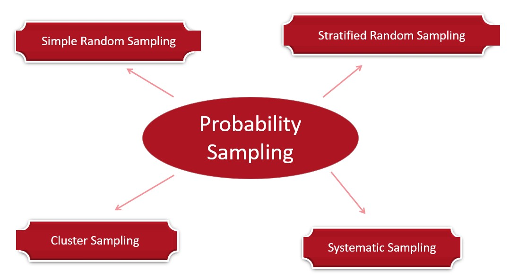

#### A. *Simple Random Sampling*
- Setiap unit memiliki probabilitas yang sama untuk terpilih
- *Sampling Frame* (berisi semua unit di populasi) diambil satu secara *random* lalu di ulang hingga terpenuhi jumlah sampelnya.

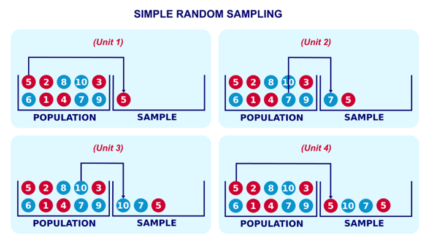

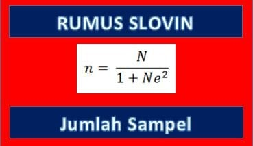

#### B. *Stratified Random Sampling*
- Ketika populasi tidak homogen.
- *Sampling Frame* (berisi semua unit di populasi) dilakukan kategorisasi (stratifikasi) setiap member pada populasi, lalu diambil satu secara *random* di setiap strata dan diulang hingga terpehuni jumlah sampelnya.

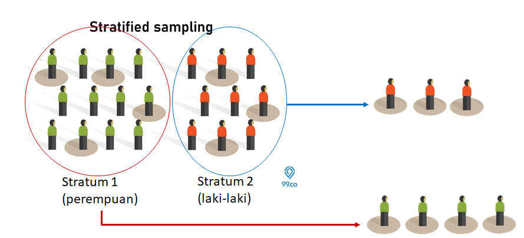

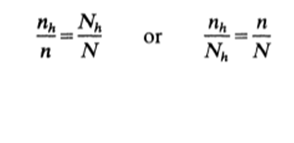

#### C. *Cluster Random Sampling*
- Ketika populasi sudah terbagi dalam beberapa kelompok. Antar kelompok homogen dan dalam satu kelompok heterogen
- Populasi Cluster dipilih cluster secara random
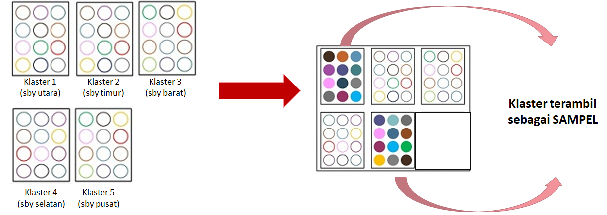

> 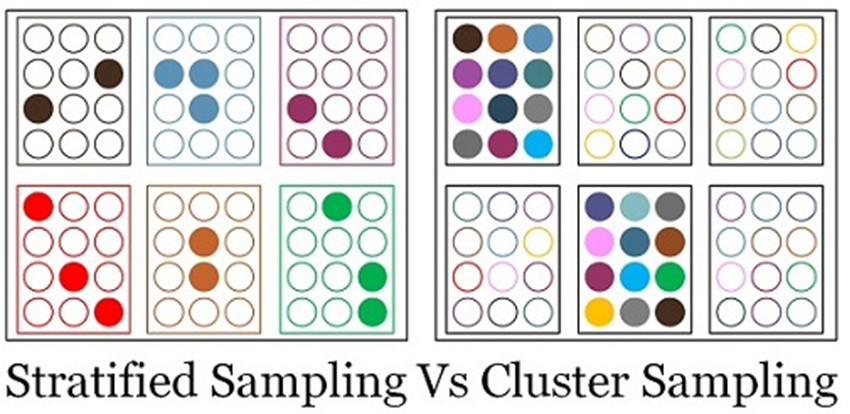

#### D. *Systematic Random Sampling*
- Sampel yang dipilih dengan cara memilih secara random titik awal dan memilih secara sistematik ke-*k* dari sampling frame.
- Populasi dipilih 1 sampel pertama secara random, lalu diambil sampel dengan kelipatan *k* unit selanjutnya.

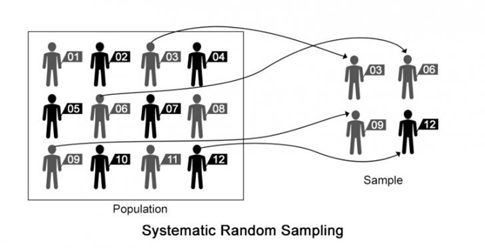

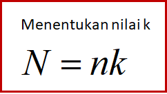

#### 1. Teknik Sampling Secara Non-Probabilitas (*Non-Probability Sampling*)
Teknik sampling nonprobabilitas adalah teknik pengambilan sample dari populasi yang ditemukan atau ditentukan sendiri oleh peneliti dan/atau menurut pertimbangan pakar.

Dan beberapa jenis atau cara penarikan sampel dari populasi secara nonprobabilitas adalah sebagai berikut:

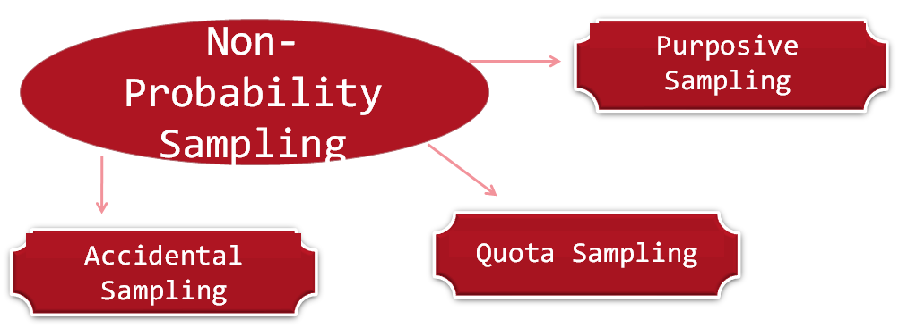

#### A. *Quota Sampling*
- Sampling kuota adalah teknik untuk menentukan sampel dari *populasi yang mempunyai ciri-ciri tertentu* sampai jumlah (kuota) yang diinginkan. 
- Teknik ini *jumlah populasi tidak diperhitungkan akan tetapi diklasifikasikan dalam beberapa kelompok.* 
- Sampel diambil dengan memberikan jatah atau quorum tertentu terhadap kelompok. 
- Pengumpulan data *dilakukan langsung pada unit sampling*. Setelah jatah terpenuhi, maka pengumpulan data dihentikan.

#### B. *Accidental Sampling*
- Metode ini juga disebut **Convenience Sampling**, yaitu teknik pengambilan sampel yang diambil secara *accidental* (Kebetulan)

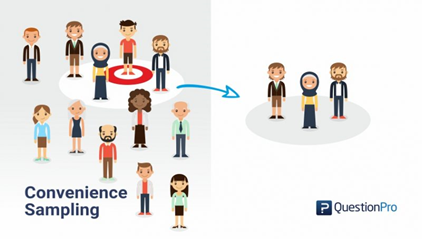

Sebagai contoh ketika kita bertemu seseorang di kampus atau di jalan dan seseorang tersebut memenuhi kualifikasi dan cocok dijadikan responden. Maka seseorang tersebut akan menjadi sampel dan selanjutnya dilakukan wawancara kepada untuk mendapatkan data

#### C. *Purposive Sampling*
Disebut juga **judgmental sampling**, yaitu teknik sampling yang satuan *samplingnya dipilih berdasarkan pertimbangan tertentu* dengan tujuan untuk memperoleh satuan sampling yang memiliki karakteristik atau kriteria yang dikehendaki dalam pengambilan sampel.

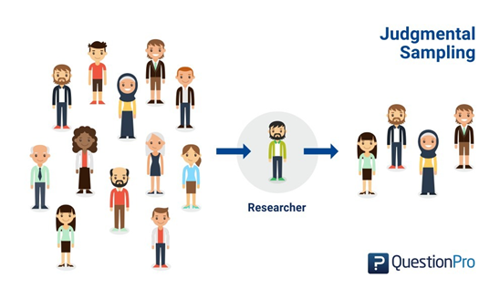

#### D. *Snowball Sampling*
Snowball sampling adalah teknik pengambilan sampel yang awal mula jumlahnya kecil, kemudian sampel ini disuruh memilih teman-temannya untuk dijadikan sampel. Dan begitu seterusnya, sehingga jumlah sampel makin lama makin banyak. 

Ibaratkan sebuah bola salju yang menggelinding, makin lama semakin besar. 
> Note: Pada penelitian kualitatif banyak menggunakan sampel purposive dan snowball.

#### Kesimpulan

| Probability Sampling             | Non-Probability Sampling               |
|----------------------------------|----------------------------------------|
| - Gambaran Populasi Akurat       | - Gambaran Populasi kasar              |
| - Dimaksudkan untuk generalisasi | - Tidak dimaksudkan untuk generalisasi |
| - Sampel Representatif           | - Sampel tidak representatif           |
| - Menggunakan konsep peluang     | - Tanpa menggunakan konsep peluang     |

---
Referensi: https://www.statistikian.com/2012/10/pengertian-populasi-dan-sampel.html